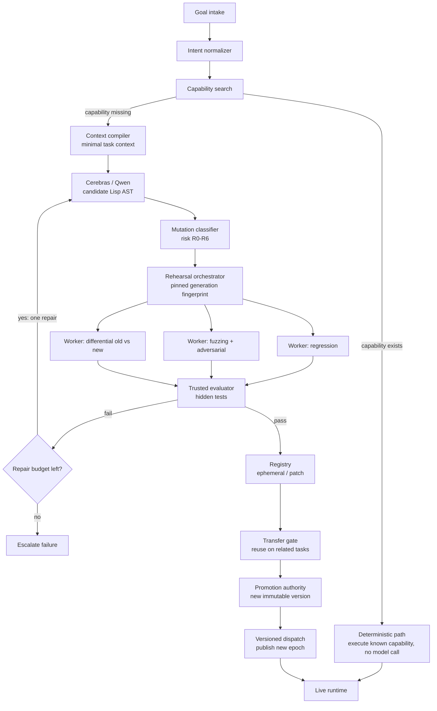

# Self-Evolving Lisp Runtime

A persistent Common Lisp system that turns expensive model reasoning into
tested, reusable executable capabilities — so future tasks in the same domain
need progressively less inference.

> How much model reasoning can the system permanently replace with safe,
> reusable computation?

## Pipeline



Green-stop: the harness, not the model, declares success. No speculative
candidate touches canonical state; promotion requires independent evidence.

## Repo map

| Path | Contents |
|---|---|
| `plan.md` | Full specification (source of truth) |
| `memory.md` | Advisory learning-layer design |
| `todos.md` | Execution-ordered task list |
| `documents/` | Planning/research digests derived from the specs |
| `docs/` | GitHub Pages site (thesis + benchmarks), served from `/docs` |
| `cerebras_client.py` | Cerebras inference client (Python + OpenAI SDK) |

## Quickstart

```powershell
uv run python cerebras_client.py "Reply with exactly: OK"
```

Reads `CEREBRAS_API_KEY` (or `CEREBRAS`) from `.env`. See
`documents/roadmap.md` for build phases and current status.
